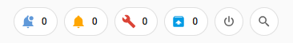

# System Badges

Six specialized badge types for Home Assistant system status: Updates, Repairs, Notifications, Combined, Search, and Restart Menu.

[](https://github.com/hacs/integration)
[](https://github.com/thecodingdad/system-badges/releases)

## Screenshot



## Badge Types

| Badge Type | Description |
|------------|-------------|
| `custom:system-updates-badge` | Shows count of available updates |
| `custom:system-repairs-badge` | Shows count of active repairs |
| `custom:system-notifications-badge` | Shows count of persistent notifications |
| `custom:system-combined-badge` | Shows combined count of updates + repairs + notifications |
| `custom:system-search-badge` | Opens the Quick Bar search |
| `custom:system-restart-badge` | Opens restart menu (Reload, Restart, Reboot, Shutdown, Safe Mode) |

## Prerequisites

- Home Assistant 2026.3.0 or newer
- HACS (recommended for installation)

## Installation

### HACS (Recommended)

[](https://my.home-assistant.io/redirect/hacs_repository/?owner=thecodingdad&repository=system-badges&category=plugin)

Or add manually:
1. Open HACS in your Home Assistant instance
2. Click the three dots in the top right corner and select **Custom repositories**
3. Enter `https://github.com/thecodingdad/system-badges` and select **Dashboard** as the category
4. Click **Add**, then search for "System Badges" and download it
5. Reload your browser / clear cache

### Manual Installation

1. Download the latest release from [GitHub Releases](https://github.com/thecodingdad/system-badges/releases)
2. Copy the `dist/` contents to `config/www/community/system-badges/`
3. Add the resource in **Settings** → **Dashboards** → **Resources**:
   - URL: `/local/community/system-badges/system-badges.js`
   - Type: JavaScript Module
4. Reload your browser

## Usage

### Updates Badge

```yaml
type: custom:system-updates-badge
icon: mdi:update
color: orange
hide_when_zero: true
```

### Combined Badge

```yaml
type: custom:system-combined-badge
hide_when_zero: true
tap_action:
  action: navigate
  navigation_path: /config/updates
```

### Restart Badge

```yaml
type: custom:system-restart-badge
icon: mdi:restart
```

## Configuration

### Common Options (all badge types)

| Option | Type | Default | Description |
|--------|------|---------|-------------|
| `icon` | string | (per type) | Custom MDI icon |
| `icon_color` | string | — | Icon color (CSS) |
| `color` | string | — | Badge/count color (CSS) |
| `hide_when_zero` | boolean | false | Hide badge when count is 0 |
| `tap_action` | object | (per type) | Custom tap action |
| `hold_action` | object | — | Custom hold action |
| `double_tap_action` | object | — | Custom double-tap action |

### Built-in Actions

`navigate`, `url`, `more-info`, `call-service`, `fire-dom-event`, `notification-popup`, `restart-dialog`, `quick-bar`

## License

This project is licensed under the MIT License - see the [LICENSE](LICENSE) file for details.
